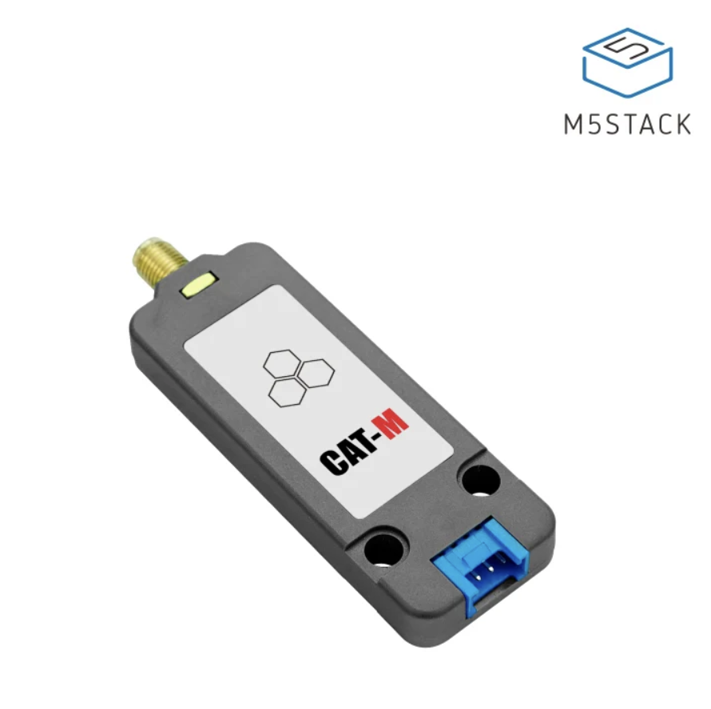

# SIM7080G CAT-M/NB-IoT Unit
This is an example repository to show how to use the SIM7080G CAT-M/NB-IoT unit.

  

# Getting started 
PlatformIO is used to compile and upload the code to the Arduino. You can download it [here](https://platformio.org/install/ide?install=vscode).

Then clone this repository and open it in PlatformIO. You can then compile and upload the code to the esp32.

# Wiring
The SIM7080G unit is connected to the ESP32 using the following pins: 

| Source | Destination |
|--------|-------------|
| 5V     | VIN         |
| GND    | GND         |
| RXD    | 16          |
| TXD    | 17          |

